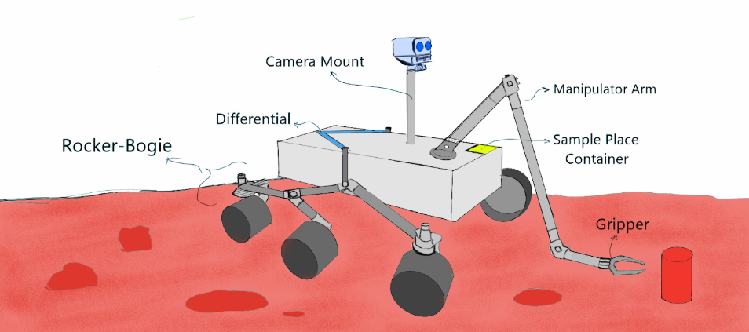
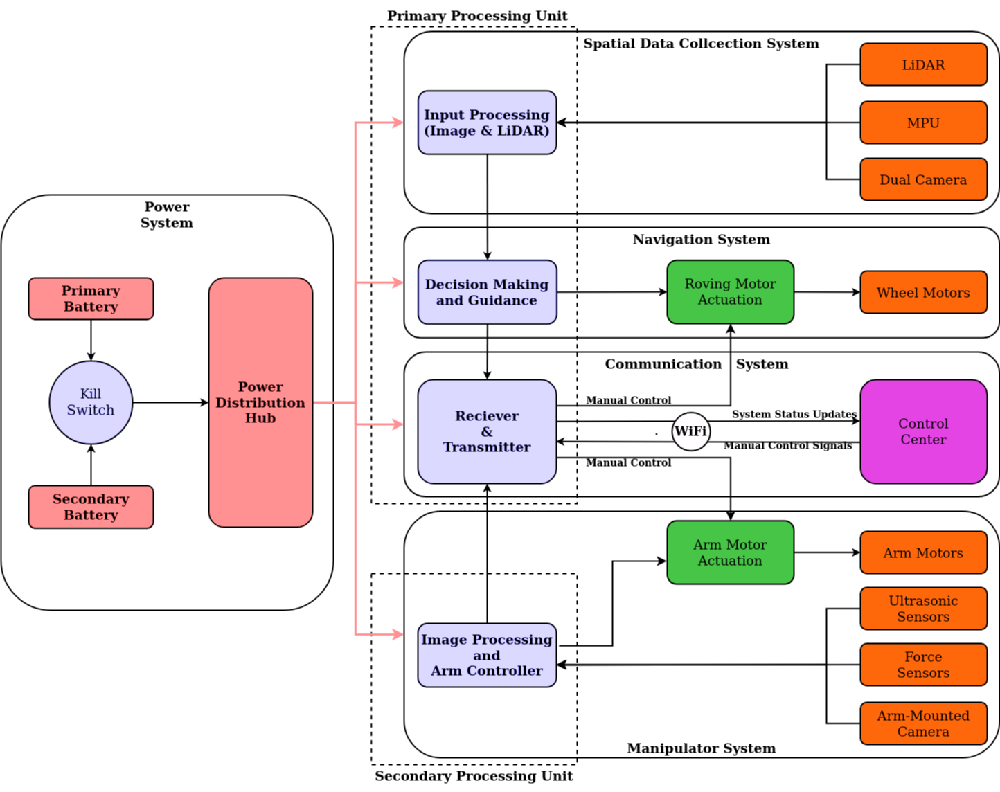
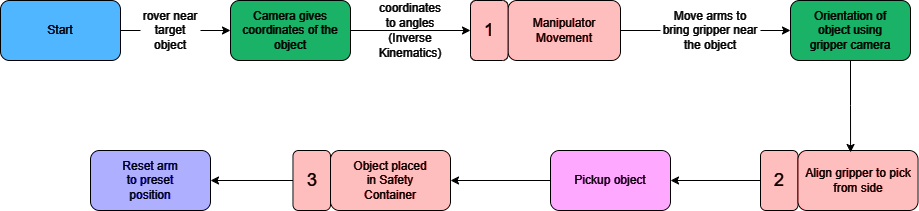

# Project Rover
<!-- Introductory description of around 80 words for the project carried out. May contain aim or motivation of the project. May include status of project in competions, events etc. -->
This repo contains all the resources used in the rover project started as part of IROC-2024. 

## Objectives
- We have attempted to build a lunar exploration rover, where we combines features like LiDAR and stereo vision with a sequential operating strategy, for accurate mapping of the terrain.
- Radio communication to be used for manual control and autonomous commanding to be implemented through the Jetson microcontroller, based on pre-trained ML models.
- We have also included high-torque DC motors for improved stability, and an individual camera on the arm to ensure precision while sample picking. 



<!-- ## Review -->
<!-- Must note down literature review / Online research done before attempting this project. How does this one stand different from others (if attempted already). Current scenario in market if present. Do include [links](https://scholar.google.co.in/citations?view_op=top_venues&hl=en&vq=eng_robotics)  -->

<!-- # Components and materials
- Write down
- Materials used
- In bullet points -->

# Working Idea
Below diagram shows the control flow of the rover.

- The primary processing unit (Jetson) controls is responsible for spatial data collection and using stereo-vision computations, will map out the terrain. 
- The generated map will be used to send instructions to the wheel motors through the roving motor actuation, to navigate the terrain.
- Jetson will also be connected through WiFi to the Control Centre, where the team can access and control the rover and manipulator actions.
- Individual components (eg: arm-mounted camera and motors, ultrasonic and force sensors etc.) will be controlled via the secondary processing unit (presumably an Arduino Mega). This is mainly to reduce the load on Jetson. This secondary processing unit is entirely responsible for the arm and gripper operations. Ultrasonic and Force sensors are to ensure that the gripper collects the target object with precision. 



<!-- # Circuit Diagram
Must contain a well documented circuit diagram of components used. -->
## Current Progress
### Algorithm
#### The planned operations of the primary operating system - Jetson are the following:

:x: Based on the stereo-vision computations, will map out the local environment and implement the Simultaneous Localization and Mapping (SLAM) algorithm.

:x: Heuristic path-finding and re-planning on encounter with obstacles will be performed repeatedly as the rover autonomously navigates the terrain.
The algorithm will also be trained to detect hurdles in the path and will autonomously decide whether to maneuver past them or not.

:white_check_mark: The pre-trained ML model will identify the required pickup object (in this case, a cylinder). [The file named cylinder.py actually does this, i.e., using the camera detect the cylinders.]

:x: Using the camera attached to the arm, the rover estimates the position of the target at will perform pickup operations as necessary (the position estimation thing is not done yet).

### Rover Control
:white_check_mark: Individual software based control modules have been build for different mechanical parts of the rover.

:x:However, they are yet to be integrated with rover navigation. 

:white_check_mark: Inverse kinematics based arm control has also been implemented and tested.

:x: However, gripper control and pickup is yet to be implemented.

The arm control flowchart is given below.



<!-- :x: How to integrate all the components in the future? -->

### Control Centre (aka Web Integration)
:x: Proposed web integration module will act as a dashboard from which the team can manually view and control the rover and the arm movements.


## Directory Tree
```
rover
│
└───Design Models
│   (Mechanical Design Documentation)
│
└───ObjectDetect
│   │   cylinder.py (Working code)
│   │ 
│   └───Dataset (Images used for training)
│   └───runs
│       │
│       └───train2 (Working ML model)
│       
└───Sensor Integration
│   │ (arduino based code to control the mechanics of the rover)
│   │ 
│   └───inverse kinematics
│   │   ...
```

## Links
### Updates
- [Updates Doc](https://docs.google.com/document/d/16TDsY9T9-KBaweeewfRRz29wUWmzG7K-f-z0tWX4v24/edit?usp=sharing)

<!-- # Chassis / Body Design 

│   │   file011.txt
│   │   file012.txt
│   │
│   └───subfolder1
│       │   file111.txt
│       │   file112.txt
│       │   ...

Small description
- Note down in
- bullet points
- about the
- dimesions, weight
- etc -->

<!-- # Guide to how the prepared product be used.
- Try to use
- bullet points

# Scope of Improvement
- This template can be made more detailed\

# Team Members
- Girija Sankar Ray -->
